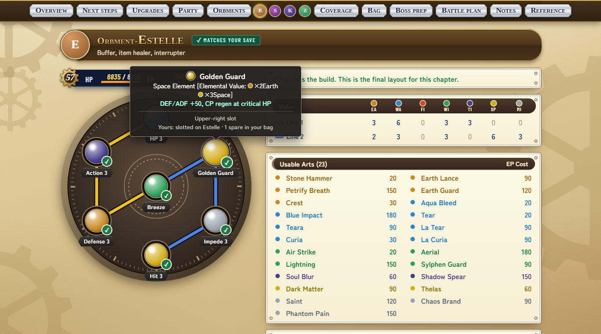
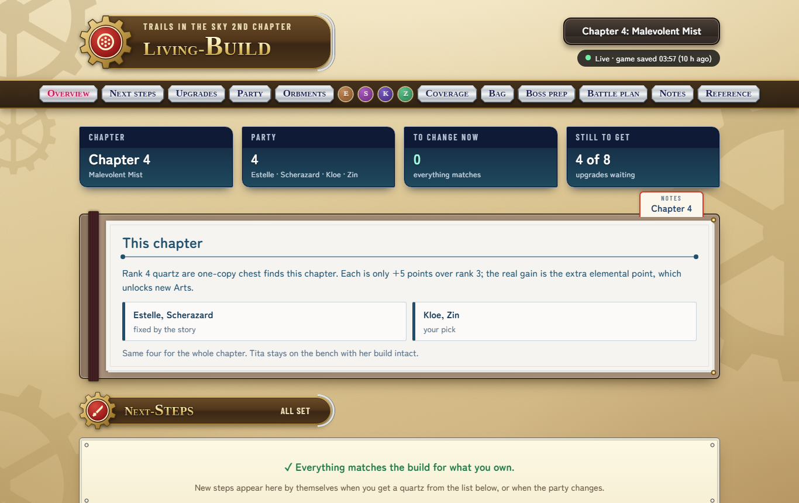
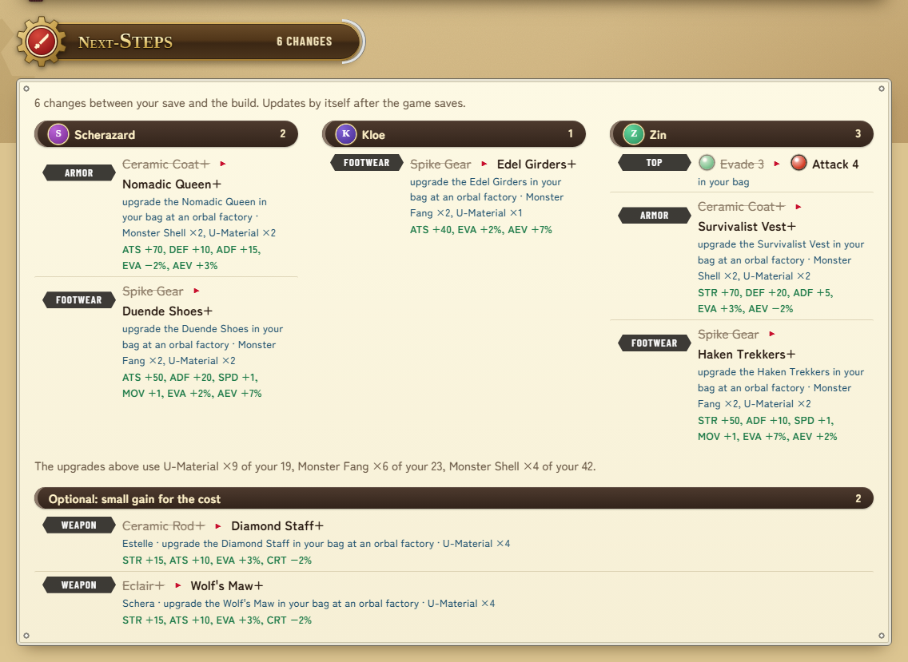
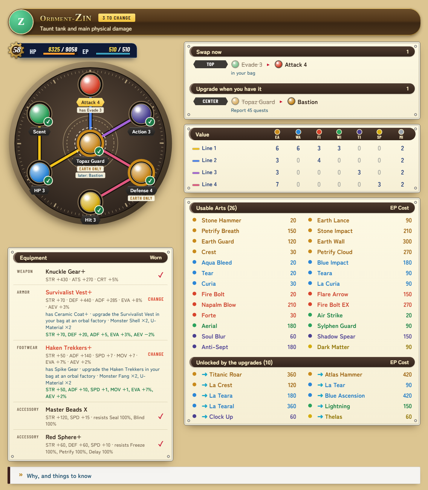
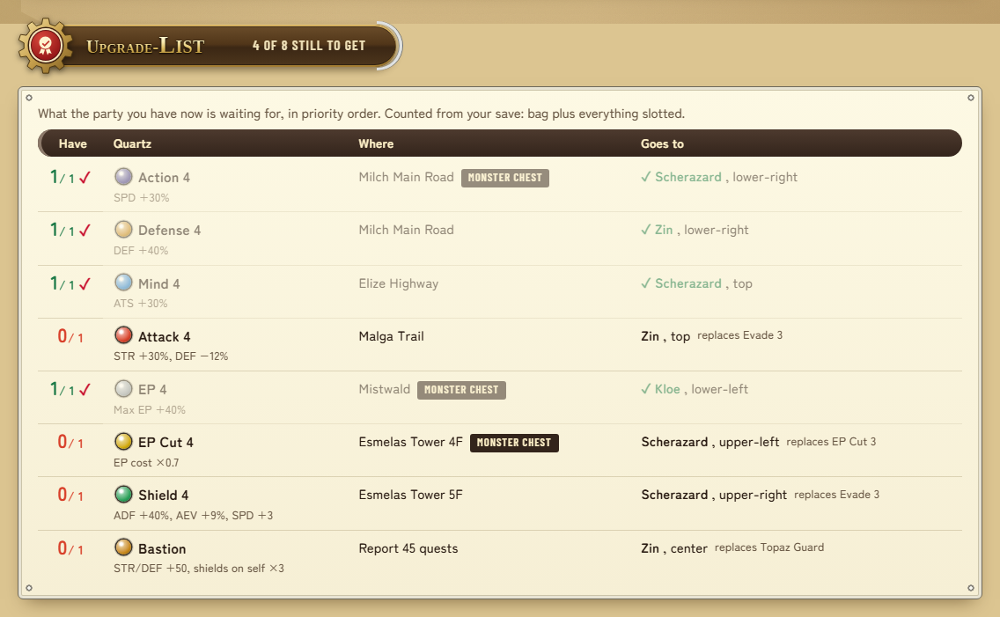
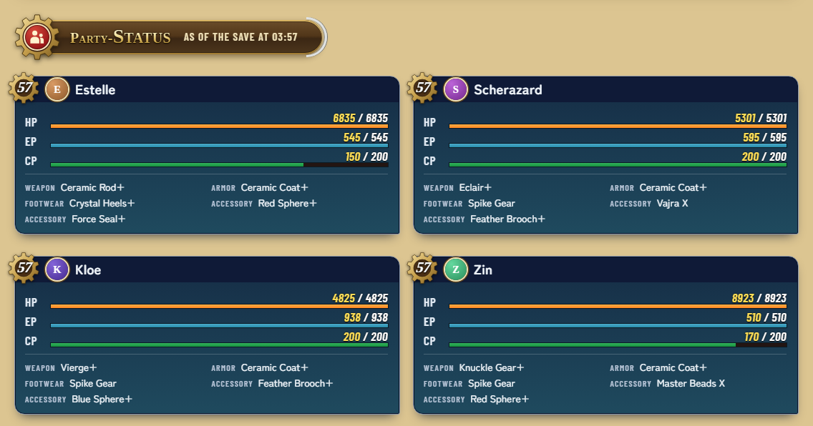
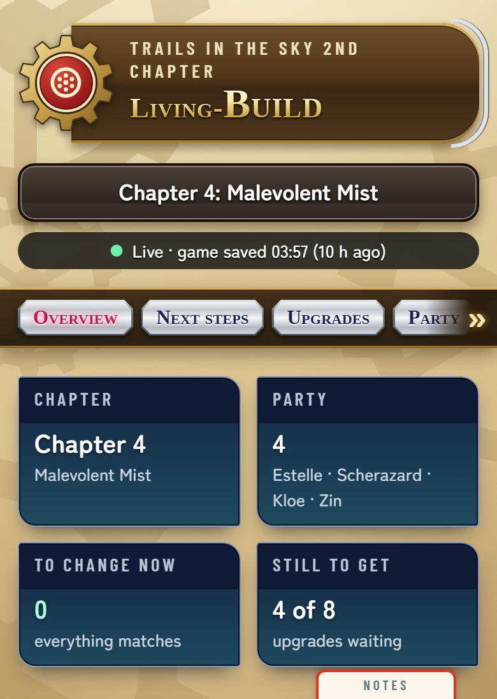
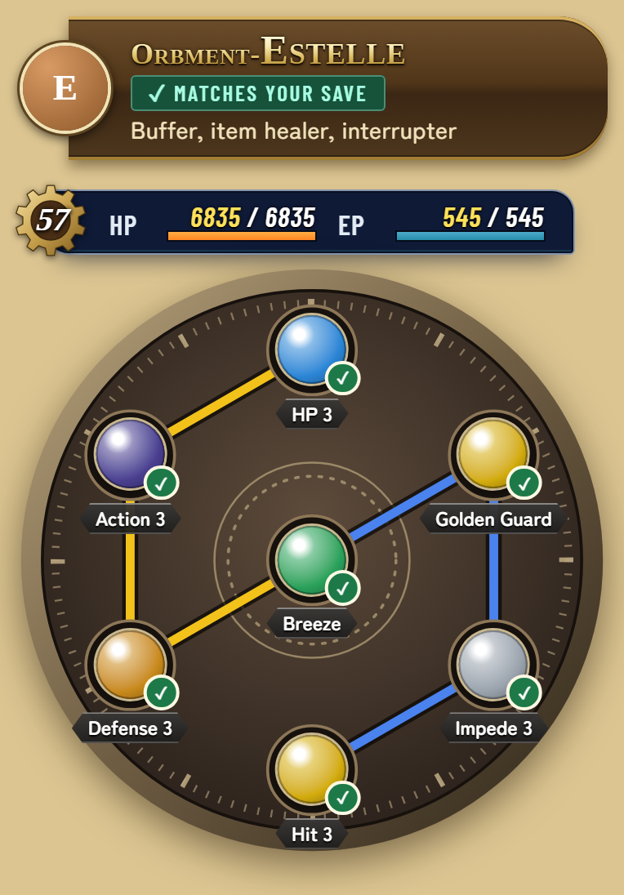
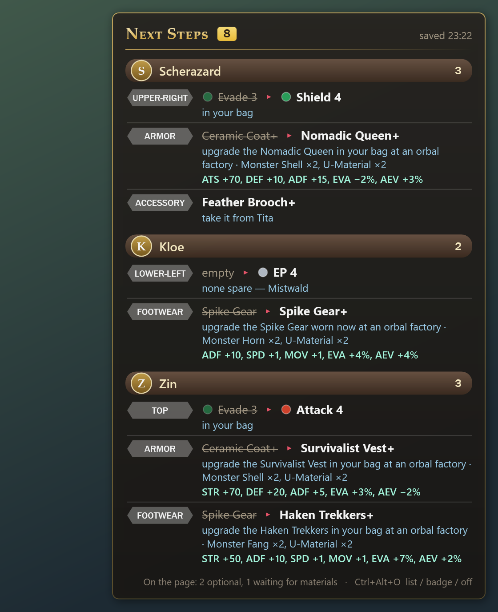
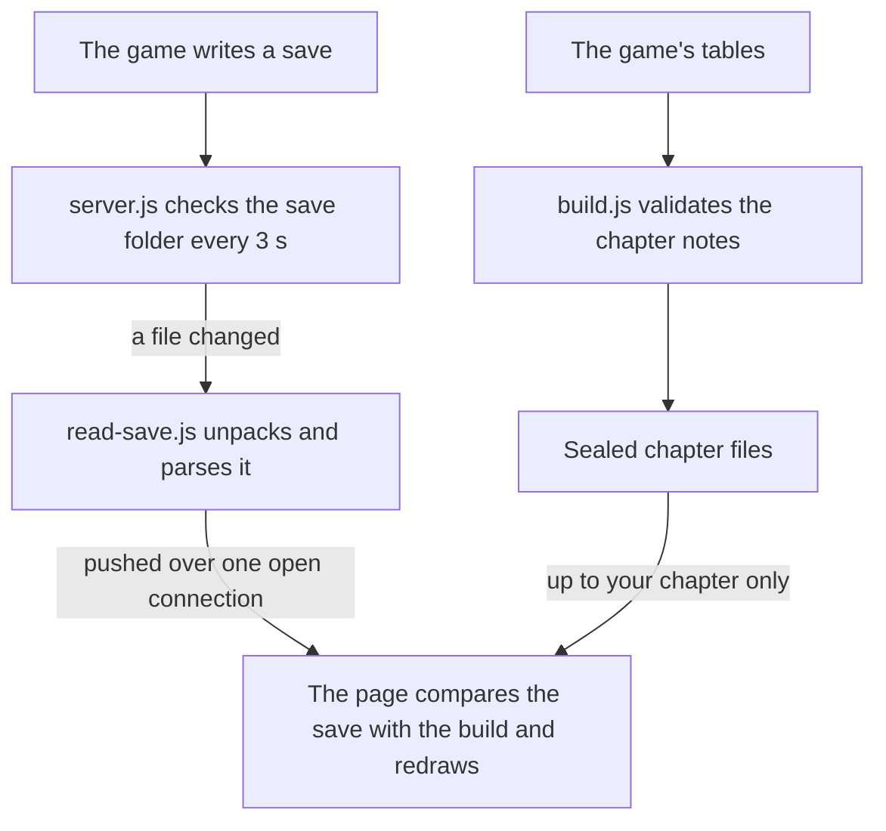

<h1 align="center">Sky 2nd Chapter — Living Build</h1>

<p align="center">
  A party-build companion for <i>Trails in the Sky 2nd Chapter</i> (2026 remake) that reads your save file<br>
  and tells you what to slot, what to pick up next, and what your party can cast right now.
</p>

<p align="center">
  <a href="https://ldallacqua.github.io/trails-sky-2nd-build/"></a>
  
  
  
</p>

<p align="center">
  <a href="https://ldallacqua.github.io/trails-sky-2nd-build/"></a>
</p>

## What it does

Guides tell you the ideal build. They do not know what is in your bag. This page does.

Run the small local server next to the game and the page follows your save: it opens the chapter you are in, shows the party you are using, ticks every slot that already matches, and turns the rest into a short to-do list that says where each missing quartz is — in your bag, on a benched character, or in a chest you have not opened yet.

It updates a few seconds after the game saves. No reload, no buttons, nothing to type.

## Highlights

- **Follows the save.** Chapter, active party and reserve, every slot, weapon, armour and accessory, the whole bag, which shop stock the story has opened, and HP, EP and CP as of the last save.
- **Spends your sepith for you.** It reads the sepith in the bag and each slot's level, takes synthesis and slot-upgrade costs from the game's tables, and turns what you can afford into steps: which quartz to synthesize, which slots to raise, in priority order.
- **Suggests the four to field.** For the stretch of the chapter your save is in: the members the game requires, then the best of the others who are with you, each with the reason. If your four differ, the page and the overlay say who to bring in for whom. Who is locked in or away is read from the save itself: it keeps the flag behind each padlock in the party menu.
- **Knows where in the chapter you are.** The save's story flags say which objective the game is showing. When the story sets the lineup for a stretch, or a decision is about to close something off, the page and the overlay say so at that point and not before.
- **Works out the Arts for you.** Each orbment's lines are traced the way the game does it, the elemental values are added up, and the page lists every Art that layout can cast, with EP cost.
- **Plans with what you own.** A slot can name a target quartz and a stand-in. The page picks the best one you actually have and tells you what to swap when a better one turns up.
- **Covers everything you equip.** Weapon, armour and footwear are ranked per character from the game's item, shop and chest tables: what shops sell at this point of the story, which chest holds what, and what an upgrade costs. The page gives each one-copy piece to whoever gains most, checks the cost against the materials in your bag, and sets aside upgrades that are not worth the U-Material.
- **Shows up in the game.** An optional overlay draws the next steps in a corner of the game window, so you can follow them in the orbment and equip menus without looking away.
- **Spoiler-safe.** Notes for every chapter are in the repo, sealed. The page and the server only open the chapter your save has reached.
- **Checked against the game's own tables.** Slot layouts, element locks, quartz values and effects, accessory resistances and Art requirements are read from the game files, not typed by hand.
- **Looks like the game.** Parchment and gears, banner titles, cream list windows with a red cursor, navy status cards, Bracer Notebook pages. All of it is drawn in CSS.
- **A help window on everything.** Hover or tap a quartz, accessory, Art or item to see what it does and where yours is.
- **Small.** About 5,000 lines of plain JavaScript, HTML, CSS and one PowerShell script. No framework, no packages, no build step for the page.

## Screenshots

<p align="center">
  
</p>

<p align="center">
  
</p>

<p align="center">
  
</p>

<p align="center">
  
</p>

<p align="center">
  
</p>

<p align="center">
  
  &nbsp;&nbsp;
  
</p>

These show the drawn look, which is what the published copy uses. With the game installed, live mode swaps in the game's own icons, portraits and window art (see [Game art](#game-art)).

## Try it

**Just look.** The published copy is at **https://ldallacqua.github.io/trails-sky-2nd-build/**. It cannot see a save, so it starts on one chapter, you tick things by hand, and it asks before opening the next chapter.

**Live, next to your game.** You need the Steam version of the game on Windows and [Node.js](https://nodejs.org/) 22.15 or newer.

```bash
git clone https://github.com/ldallacqua/trails-sky-2nd-build.git
cd trails-sky-2nd-build
node server.js --open
```

That opens http://localhost:8733. On Windows you can also double-click `start-live.cmd`. There is nothing to install.

If your game or saves are not in the default places, set `SKY2_GAME_DIR` and `SKY2_SAVE_DIR` first.

## In-game overlay

<p align="center">
  
</p>

With live mode running, double-click `start-overlay.cmd`. The page's next steps appear in a corner of the game and update when the game saves.

- **It does not touch the game.** It is a separate window that stays above the game's. Nothing is injected, and no game file or memory is read or changed. Clicks and keys pass through it, and it never takes focus.
- **It gets out of the way.** It only shows while the game is the window in front. `Ctrl+Alt+O` switches between the full list, a one-line badge and off; the tray icon has the same choices, the corner to sit in, and Exit. When there is nothing to change it says so for a few seconds and disappears.
- **Nothing to install.** It is one PowerShell script using the window toolkit that ships with Windows. The launcher starts it with `-ExecutionPolicy Bypass`, which lets that one unsigned local script run for that one process and changes no setting.
- **The game has to run borderless or windowed.** No ordinary window can draw over exclusive fullscreen.

Options go after the file name: `start-overlay.cmd -Corner BottomLeft -Scale 1.2`. The picture above is the drawn look; with the game's art extracted, the overlay uses the game's icons and portraits like the page does.

## How live mode works



- **Cheap.** Each tick is one `stat` call per save slot. A save is only read and unpacked (about 150 KB, a few milliseconds) when its timestamp or size changes. The page does not poll.
- **Read-only.** The server never writes to the save folder or the game folder.
- **Local.** It listens on 127.0.0.1 only.

## Spoiler-safe by design

The notes cover every chapter, and none of that should leak to someone who is still playing.

- Chapter notes are stored as `chapters/chN.dat`, base64-sealed, so browsing the repo, reading a diff or searching it does not show a chapter you have not reached.
- The live server refuses to hand out a chapter beyond the one in your save.
- Characters who are not with you in the save are not shown, even when the notes have a build for them.
- Boss notes and party changes inside a chapter are collapsed until you open them.
- Advice tied to a stretch of a chapter is only shown once the save's story flags reach that stretch.

## Built from the game's data

Earlier versions of these notes were typed by hand and got things wrong: items under the wrong name, a quartz in a slot it cannot go in. So the page's data is now built, not written.

`tools/build.js` reads the game's own tables and takes from them every character's line layout and slot locks, every quartz's colour, elemental value and effect, every accessory's stats and resistances, every Art's requirements, EP cost and description, and for weapons, armour and footwear the stats, shop stock by story point, upgrade recipes and chest locations. The chapter notes only say *which* quartz goes *where*. The build stops with an error if a note names something that does not exist, puts a quartz in a slot that is locked to another element, or slots two of the same kind on one orbment.

Names are the English ones from the game's files, so what the page says is what the menu says.

## Game art

The page is styled after the game's menus, and every part of that is drawn in CSS, so the published copy ships no images from the game.

In live mode the server can go one step further. The first time it needs them, it reads a few textures from **your own install** and writes them to `assets/`: the icon sheet, the orbment face, window corners, gears and menu icons, and a portrait, cut-in and standing art per character. The page then uses those instead of the drawn versions.

- `assets/` is in `.gitignore`. The art belongs to the game's publisher; it is never committed or published. Only the extractor is.
- Character art is extracted one character at a time, only for characters in your save, and the server refuses to serve any other.
- `node server.js --no-assets` keeps the drawn look. `node tools/extract-assets.js --clean` deletes the folder.

The decoder is in the repo and has no dependencies: `tools/texture.js` unpacks LZ4, decodes BC7 and writes PNG in about 240 lines.

## What is in the repo

| File | What it does |
|---|---|
| `index.html`, `styles.css`, `app.js` | The page. `app.js` draws it. |
| `model.js` | The plan itself: what each slot and each piece of gear should be given what you own, the steps to get there, the orbment lines and the Arts. Shared by the page and the server. |
| `server.js` | The local live server: watches the save folder, pushes changes to the page, gates chapters and character art, and works out the steps for the overlay. |
| `tools/overlay.ps1`, `start-overlay.cmd` | The in-game overlay and its launcher. |
| `tools/party-log.js` | A small interpreter for the game's compiled event scripts. Replays what they do to the party for a save's story flags; the save reader uses it to tell which of the save's party lists is in play. |
| `tools/read-save.js` | Reads a save: chapter, current objective, party with who is locked in or away, slots and their levels, gear, bag, sepith. Also runs on its own. |
| `tools/build.js` | Validates the chapter notes against the game's tables and writes `chapters/*.dat` and `game-data.js`. |
| `tools/extract-assets.js`, `tools/texture.js` | Pull art out of the game's image archive and decode it. |
| `chapters/chN.dat` | Sealed notes, one per chapter. |
| `game-data.js` | Generated: quartz, accessories, Arts and orbment layouts from the game's tables. |
| `data.js` | Version, and the chapter the published copy starts on. |

## Commands

| Command | What it does |
|---|---|
| `node server.js --open` | Start live mode and open the page. |
| `node server.js --port 9000` | Use another port (default 8733). |
| `node server.js --interval 10` | Check the save folder every 10 seconds (default 3). |
| `node server.js --no-assets` | Do not use the game's art. |
| `start-overlay.cmd` | Show the next steps over the game. Add `-Corner TopLeft`, `-Scale 1.2`, `-Opacity 0.8`, `-Mode Mini` or `-Always`. |
| `node tools/read-save.js` | Print what the newest save contains. Add `--json` for JSON, or pass a save file. |
| `node tools/build.js` | Rebuild `chapters/*.dat` and `game-data.js` from the notes. |
| `node tools/build.js --unseal` | Recreate the readable notes in `chapters-src/` from the sealed files. **This is the spoiler switch.** |
| `node tools/build.js --report N` | Print chapter N's lines, values and Arts per character. |
| `node tools/build.js --check-fx` | Compare the hand-written quartz effect lines with the game's table. |
| `node tools/extract-assets.js --clean` | Delete the extracted art. |

Add `?once` to the live URL to read the save a single time without keeping a connection open. That is handy for screenshots and tests.

## Editing the notes

The readable notes live in `chapters-src/` (one `chN.js` per chapter, plus shared templates in `_lib.js`). That folder is not committed; `--unseal` recreates it on a fresh clone. A slot is either a quartz name or `[target, stand-in until you own it]`.

A chapter can also list `stages`: stretches with their own lineup or advice. Each names the objective the game shows when it starts (`from`) and the one it shows when it is over (`until`), and can carry a title, paragraphs of text, a one-line note for the to-do list and the overlay, the lineup rules, and a changed role or extra notes per character. A chapter, and any stage, can carry a `lineup`: `fixed` (required by the game), `away`, and `rank`, everyone else best first as `[id, reason]`; a third entry `'='` marks someone as good as the one above, so the page keeps whichever of the two you already field. The build looks the objectives up in the game's quest table and stores the story flags behind them; the page shows a stage when the save has the first flag and not the second.

After changing a note, run `node tools/build.js` and commit the regenerated files. Pushing to `main` publishes the page through GitHub Pages.

## Limits

- **Steam version on Windows.** The default paths, `start-live.cmd` and `--open` assume it. The server itself is plain Node and takes the two paths from environment variables. The overlay is Windows only.
- **Everything follows the save, not the screen.** The page and the overlay change when the game writes a save, not the moment you move a quartz in the menu.
- **The save layout was found by inspection.** The reader checks the layout before trusting it and stops with an error if a game update moves things, rather than showing wrong data.
- **The builds are one player's choices.** They were written for a single playthrough. The page follows any save, but the advice reflects that party and those priorities.

## Credits

- Chapter research draws on Japanese guide sites, cross-checked against the game's tables.
- The BC7 decoder in `tools/texture.js` is a port of [bcdec](https://github.com/iOrange/bcdec) (MIT).
- Fonts: [Tinos](https://fonts.google.com/specimen/Tinos), [Zen Maru Gothic](https://fonts.google.com/specimen/Zen+Maru+Gothic) and [Barlow Condensed](https://fonts.google.com/specimen/Barlow+Condensed), from Google Fonts.

This is an unofficial fan project. It is not affiliated with or endorsed by Nihon Falcom or the game's publishers. *Trails in the Sky* and all names from the game belong to their owners. No game files are included in this repository.
